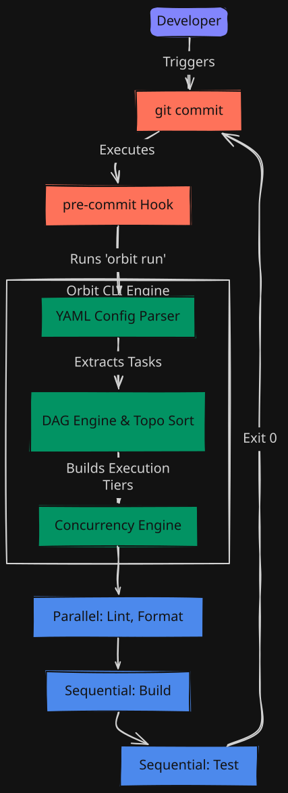
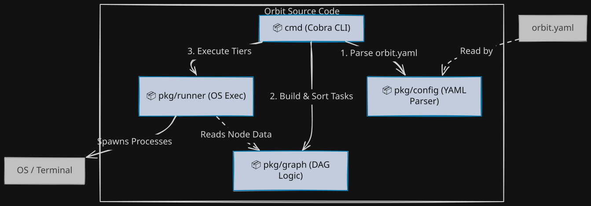
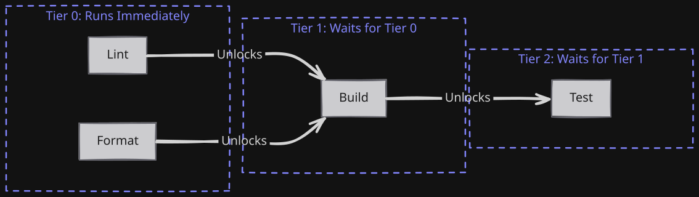

# Orbit 🪐


*(Note for contributors: When cutting a release, ensure the CI workflow is green on `main` before pushing a `v*` tag. The release workflow relies on the existing state of the codebase.)*

**Orbit** is a localized, high-performance DAG-based task orchestrator designed to act as an instant CI/CD gatekeeper for your Git commits. 

By intercepting Git hooks (like pre-commit), Orbit intelligently schedules validation checks—such as formatters, linters, and unit tests. Instead of naive parallel execution, Orbit parses task configurations into a Directed Acyclic Graph (DAG), maximizing CPU efficiency by executing independent tasks concurrently while strictly enforcing execution order for dependent tasks.

<div align="center">
  <br>
  
  <br>
</div>

## Features
- **DAG Engine:** Parses tasks using Topological Sort (Kahn's algorithm).
- **Maximum Concurrency:** Independent tasks run in parallel using Go Goroutines.
- **Smart Path Filtering:** Automatically skips tasks if relevant files haven't changed, saving precious execution time.
- **Zero-Dependency:** A single Go binary that doesn't bloat your project repository.
- **Git Hook Integration:** Automatically intercepts commits to prevent broken code from being pushed.

## System Architecture
Orbit decouples parsing, graph math, and process execution into clean packages:

<br>
<div align="center">
  
</div>
<br>

## Commands
Orbit comes with a few built-in commands to manage your pipelines:
- `orbit init` - Generates a sample `orbit.yaml` and installs the Git pre-commit hook. Use `--force` or `-f` to overwrite existing configurations.
- `orbit run` - Manually executes the task pipeline based on your `orbit.yaml`.
  - Use `--all` to force run all tasks regardless of path filters.
  - Use `--quiet` or `-q` to suppress non-essential output and only print failures (ideal for CI/CD).
- `orbit validate` - Parses the YAML, builds the DAG, and checks for syntax errors, missing dependencies, or cycles *without* executing any tasks. Perfect for CI environments!

## Exit Codes
When executing pipelines via `orbit run` or validating via `orbit validate`, Orbit uses the following standard exit codes:
- **`0`**: Success
- **`1`**: Configuration or validation error (e.g., malformed `orbit.yaml`, invalid glob pattern)
- **`2`**: DAG logic error (e.g., cycle detected, missing dependencies)
- **`3`**: Task execution failure (one or more tasks returned a non-zero exit code)
- **`4`**: Task timeout exceeded (takes priority over `3` in mixed-failure tiers)

## Schema Compatibility Contract
Orbit guarantees strict backwards compatibility within the same major schema version.
- **Version 1 (`version: 1`)**: The current stable schema.
- Within the same major schema version, fields are only ever added, never removed or repurposed.
- A field's meaning, once shipped, doesn't change without a version bump.
If your `orbit.yaml` lacks a `version` field, it implicitly defaults to `version: 1`.

## How it works
Orbit looks for an orbit.yaml file in the root of your project:

```yaml
tasks:
  lint:
    command: "npm run lint"
    depends_on: []
    trigger_paths: ["**/*.js", "**/*.ts"] # Only run if JS/TS files change
  format:
    command: "prettier --write ."
    depends_on: []
    ignore_paths: ["vendor/**", "node_modules/**"] # Skip if changes are in these directories
  build:
    command: "npm run build"
    working_dir: "./frontend" # Execute command in a specific directory
    depends_on: ["lint", "format"] # Build waits until lint and format finish
```

Behind the scenes, Orbit groups the tasks into dependent "Tiers" and processes them exactly like this:

<br>
<div align="center">
  
</div>
<br>

*(This project is currently under active development).*

